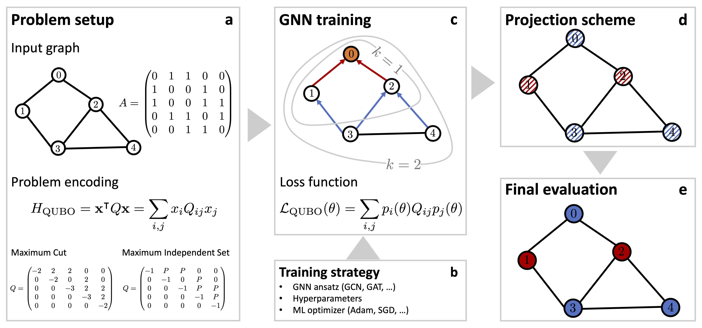

## Combinatorial Optimization with Graph Neural Networks

## Introduction

Combinatorial optimization problems are pervasive across science and industry alike. Modern deep learning tools are 
poised to solve these problems at unprecedented scales, but a unifying framework that incorporates insights from 
statistical physics is still outstanding. Here we demonstrate how graph neural networks can be used to solve 
combinatorial optimization problems. Our approach is broadly applicable to canonical NP-hard problems in the form of 
quadratic unconstrained binary optimization problems, such as maximum cut, minimum vertex cover, maximum independent 
set, as well as Ising spin glasses and higher-order generalizations thereof in the form of polynomial unconstrained 
binary optimization problems. We apply a relaxation strategy to the problem Hamiltonian to generate a differentiable 
loss function with which we train the graph neural network and apply a simple projection to integer variables once 
the unsupervised training process has completed. We showcase our approach with numerical results for the canonical 
maximum cut and maximum independent set problems. We find that the graph neural network optimizer performs on par 
or outperforms existing solvers, with the ability to scale beyond the state of the art to problems with millions 
of variables.

## Method



Flow chart illustrating the end-to-end workflow for the proposed physics-inspired GNN optimizer. (a), The problem 
is specified by a graph G with associated adjacency matrix A, and a cost function as described (for example) by the 
QUBO Hamiltonian HQUBO. Within the QUBO framework the cost function is fully captured by the QUBO matrix Q, as 
illustrated for both MaxCut and MIS for a sample (undirected) graph with five vertices and six edges. (b), The 
problem setup is complemented by a training strategy that specifies the GNN Ansatz, a choice of hyperparameters 
and a specific ML optimizer. (c), The GNN is iteratively trained against a custom loss function LQUBO(θ) that 
encodes a relaxed version of the underlying optimization problem as specified by the cost function HQUBO. Typically, 
a GNN layer operates by aggregating information within the local one-hop neighbourhood (as illustrated by the k = 1 
circle for the top node with label 0). By stacking layers one can extend the receptive field of each node, thereby 
allowing distant propagation of information (as illustrated by the k = 2 circle for the top node with label 0). 
(d)-(e), The GNN generates soft node assignments which can be viewed as class probabilities. Using some projection 
scheme, we then project the soft node assignments back to (hard) binary variables xi = 0, 1 (as indicated by the 
binary black/white node coloring), providing the final solution bit string x.

## Example code

In this notebook ([gnn_example.ipynb](gnn_example.ipynb)) we show how to solve combinatorial optimization problems 
with physics-inspired graph neural networks, as outlined in M. J. A. Schuetz, J. K. Brubaker, H. G. Katzgraber,
_Combinatorial Optimization with Physics-Inspired Graph Neural Networks_, 
[arXiv:2107.01188](https://arxiv.org/abs/2107.01188). Here we focus on the canonical maximum independent set 
(MIS) problem, but our approach can easily be extended to other combinatorial optimization problems. For the 
actual implementation of the graph neural network we use the open-source ```dgl``` library. 

## Environment Setup

Please note we have provided a `requirements.txt` file, which defines the environment required to run this code. 
Because some of the packages are not available on default OSX conda channels, we have also provided suggested 
channels to find them on. These can be distilled into a single line as such:

> conda create -n <environment_name> python=3.8 --file requirements.txt -c conda-forge -c dglteam -c pytorch

**NOTE:** The contents of the requirements file are pegged to python version 3.8, and have been tested with 
versions 3.8.5 and 3.8.12. It's possible to use more recent python versions (3.9+), but the specified 
requirements packages will likely have version conflicts, therefore we recommend sticking to python 3.8. 
Environment setup is expected to take a couple of minutes (2-5min), depending on package download speeds.

## Code Execution

Once the virtual environment is established (see above), running the code is straightforward. From the parent folder, 
launch the notebook via 

> conda activate <environment_name>
> jupyter notebook gnn_example.ipynb

Once in the notebook, run the cells via 

`Cell` > `Run All` 

or 

`Kernel` > `Restart & Run All`

**NOTE:** On a standard laptop (e.g. a 2019 13" MacBook Pro), the full notebook takes ~30-60 seconds to run. 
This should not vary much across hardware, as the code is not parallelized and the problem instance and 
GNN model are small enough to fit in memory.

### Key Hyperparameters

`n` Problem size (e.g. graph size)

`number_epochs` The maximum number of epochs to train the GNN model

`learning_rate` Learning rate for the optimizer (Adam, AdamW, etc)

`dim_embedding` Dimensionality of embedding vector, per input

`hidden_dim` Size of intermediate hidden layer

`dropout` Fraction of nodes to drop out in each layer


## Security

See [CONTRIBUTING](CONTRIBUTING.md#security-issue-notifications) for more information.

## License Summary

The documentation is made available under the Creative Commons Attribution-ShareAlike 4.0 International License. See the LICENSE file.

The sample code within this documentation is made available under the MIT-0 license. See the LICENSE-SAMPLECODE file.

## Citation

```
@article{Schuetz2021,
  title={Combinatorial Optimization with Physics-Inspired Graph Neural Networks},
  author={Schuetz, Martin J A and Brubaker, J Kyle and Katzgraber, Helmut G},
  journal={arXiv preprint arXiv:2107.01188},
  year={2021}
}
```